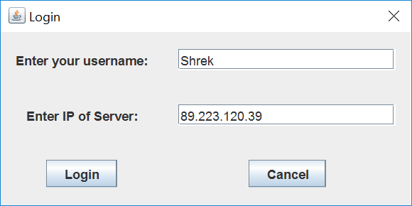
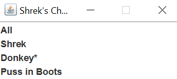
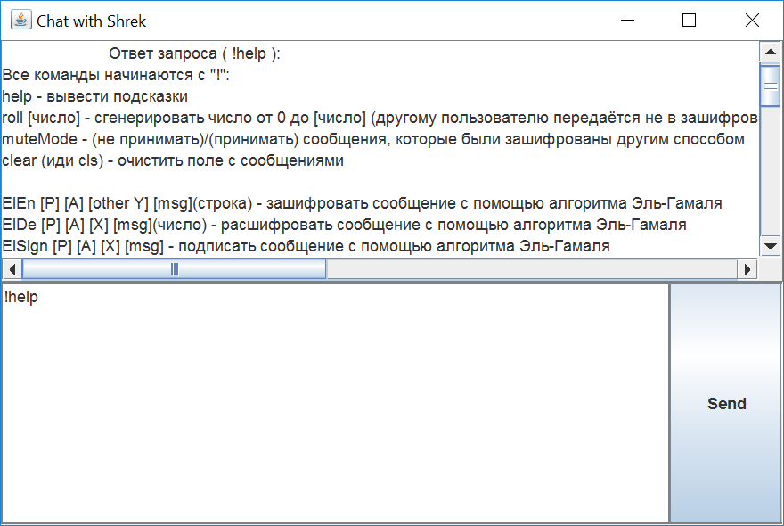
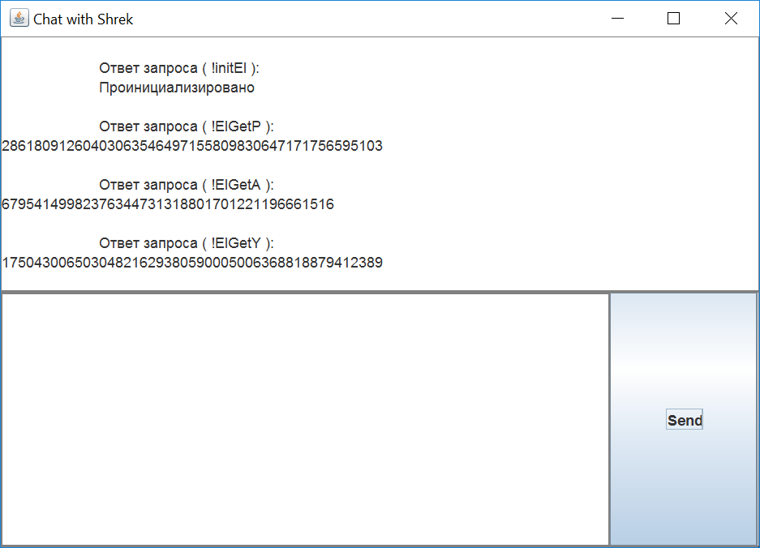
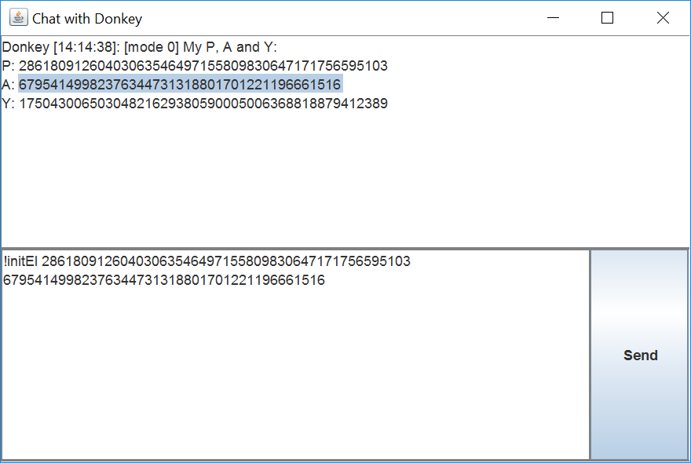
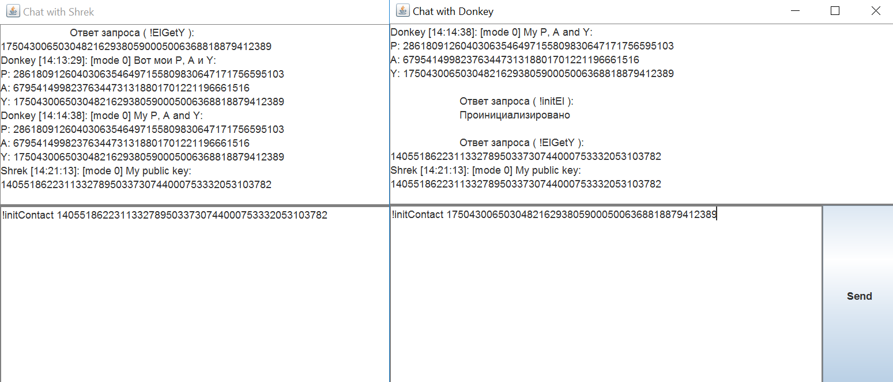
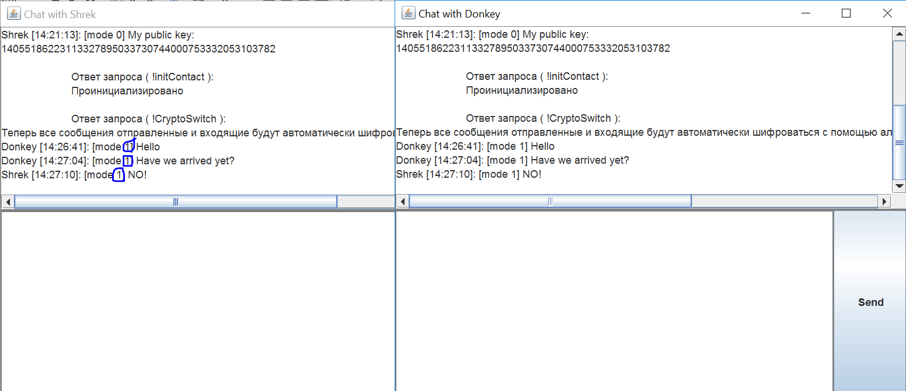
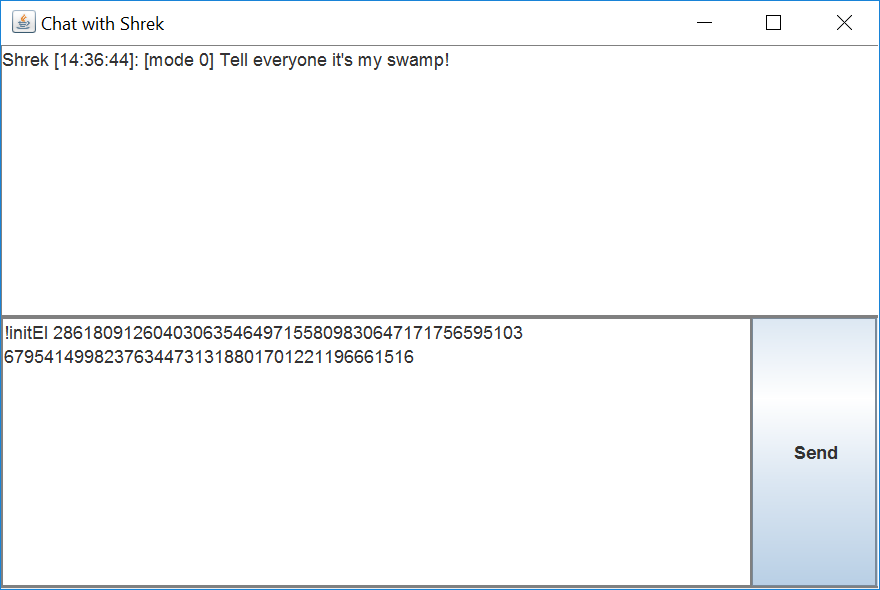
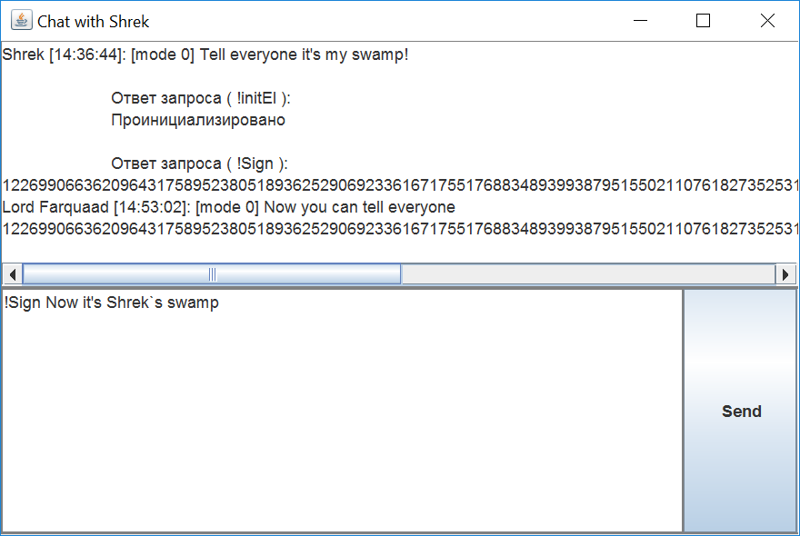
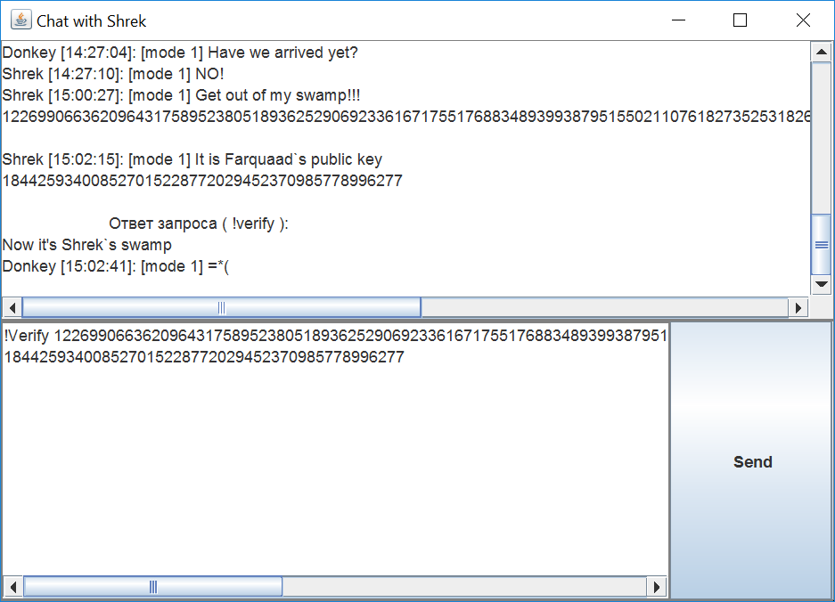

# DM2020_AltExam_ElGamalEncryption

It is realization ElGamal encryption

"Проект" заброшен (но работает), делайте с ним, что захотите.

Учебная программа, демонстрирующая работу алгоритма Эль-Гамаля. Получился простенький мессенджер с шифрованием. Для работы нужен сервер.

# Использование

Эта программа демонстрирует работу алгоритма Эль-Гамаля. Чтобы её
запустить, перейдите в папку Release и дважды щёлкните на “Start.bat”.
Чтобы всё заработало, у вас должна быть установлена java (хотя бы версия
8). Если вы не хотите устанавливать java, то тут:
https://github.com/The220th/DM2020\_AltExam\_ElGamalEncryption - в
“README.md” есть актуальные ссылки на версию со встроенной java.

При первом запуске вам предлагается ввести имя пользователя и IP сервера
(без порта). После того, как вы введёте это перед вами, откроется список
текущих пользователей. Можно выбрать любого и тогда откроется чат с ним.
Если вам уже писали, то рядом с тем, кто вам написал, появится
звёздочка.

Теперь вы можете писать сообщения и отправлять их в незашифрованном
виде.

Чтобы посмотреть список доступных команд выполните команду “!help” в
поле, где вы пишете сообщения. Все команды начинаются с “!”.

Рассмотрим пример того, как настроить шифрование. Сперва вам нужно
инициализировать ваш “шифровальщик”. Для этого выполните команду
“!initEl”, чтобы сгенерировать все параметры заново (это очень
трудоёмкая операция, программа “зависнет” на мин 2-5), или
“!initEldefault”, чтобы сгенерировать только ваши публичный и секретный
ключи, остальные же параметры будут взяты стандартные. Если вам
предлагают уже готовые параметры P и A, то вы можете выполнить “!initEl
\[P\] \[A\]”, где вместо \[P\] и \[A\] параметры P и A соответственно.
Если вы уже знаете параметры P, A и ваши секретный и публичный ключи,
что вы можете инициализировать шифровальщик командой: “!initEl \[P\]
\[A\] \[X\] \[Y\]”, где X и Y ваши секретный и публичный ключи. Теперь
вы можете использовать команды:

“!ElGetY” - получить ваш публичный ключ

“!ElGetX” - получить ваш секретный ключ

“!ElGetP” - получить P

“!ElGetA” - получить A

Следующим шагом вам нужно узнать публичный ключ пользователя, которому
вы хотите отправить сообщение. После этого используйте команду
“!initContact \[публичный ключ того, кому вы пишете сообщение\]”. После
командой “!ElGetContactY” можно посмотреть на этот ключ.

Теперь можно переключиться на режим шифрования сообщений с помощью
алгоритма Эль-Гамаля, используя команду “!CryptoSwitch 1”.

Пример. Сейчас ключи будут небольшого размера, чтобы можно было легче в
них ориентироваться. Пусть пользователь Donkey хочет написать
пользователю Shrek, используя шифрование. Сначала Donkey инициализирует
“шифровальщик”.

Далее он узнаёт P, A и свой публичный ключ и отсылает всё это
пользователю Shrek. Теперь Shrek инициализирует свой шифровальщик.

Заметим, что можно очень легко скопировать текст просто выбрав первый
символ, копируемой строчки, и потянув мышкой чуть вниз. И так, далее
пользователь Shrek отсылает Donkey свой публичный ключ.

Теперь они могут включить шифрование командой “!CryptoSwitch 1”.

“\[mode 1\]” показывает, что все сообщения теперь шифруются с помощью
алгоритма Эль-Гамаля. “\[mode 0\]” значит, что шифрование отключено,
“\[mode 2\]” – используется AES-256.

Рассмотрим теперь подпись сообщений. Пусть пользователь Lord Farquaad
хочет подписать сообщение. Он также вычисляет свои публичный и секретные
ключи.

Чтобы подписать сообщение, нужно просто выполнить команду “!sign
\[подписываемое сообщение\]”.

Теперь кто угодно может удостовериться в том, кто подписал это
сообщение, выполнив команду “!Verify \[подписанное сообщение\]
\[публичный ключ того, кто подписал это сообщение\]”.

Подпись ключей осуществляется похожим образом.

Рекомендуется использовать алгоритм Эль-Гамаля только для того, чтобы
обменяться секретными ключами для какого-нибудь симметричного алгоритма
шифрования. Ведь сам алгоритм Эль-Гамаля требует очень много
процессорного времени.

Инициализировать шифровальщик AES-256 можно с помощью команды:
“!initAES”. Далее с помощью команды “!AESgetKey” можно получить сам ключ
шифрования. Инициализировать шифровальщик AES-256 можно и с помощью
команды “!initAES \[ключ шифрования\]”. Переключиться на режим
шифрования AES-256 можно с помощью “!CryptoSwitch 2”.

# Запуск

Чтобы запустить последний относительно стабильный релиз, то, находясь в директории Release, запустите Start.bat (Линуксоиды и так знают как запустить). В директории Reports можете прочитать файл ProgramGuide.

Чтобы посмотреть на алгоритм Эль-Гамаля с малыми числами, вы можете перейти на этот сайт: https://musicfreakt.github.io/elgamal-site

Чтобы запустить текущую версию, откройте CompileAndStartClient.bat или CompileAndStartServer.bat, если вы хотите запустить сервер.

Если у вас не запускается, то скорее всего у вас старая версия java (нужна хотя бы 8ая версия) или вовсе не установлена. Также убедитесь, что вы в нужной директории и нет русских букв в пути.

<!--Если у вас не установлена java, то предлагаю установить: https://www.java.com/ru Или Можно так:  https://jdk.java.net/14 Скачайте архив, разорхивируйте его, и укажите путь к папке bin в переменную среды (в Windows - это %path%)

Если всё перечисленное выше лень делать, то можно скачать программу с портированной java, и тогда не надо ничего устанавливать. Но будет весить намного больше (~70 Мб), т.к. в архив включен jdk. Скачайте: https://drive.google.com/file/d/1pGaDMKX_FdZy3Pi8RrGVJg7sgWRd5Ht3 - разархивируйте и просто запустите Start.bat-->
